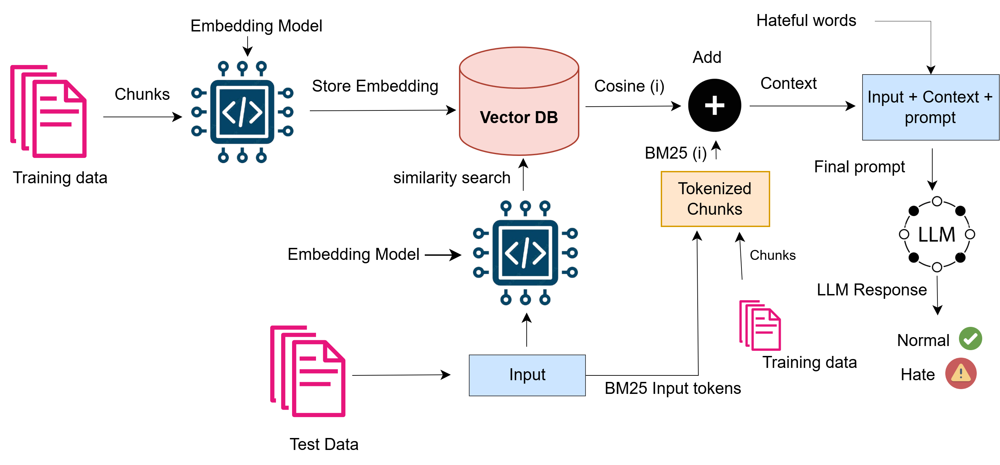

<!--- This repository is the official repository of:  [Our paper will appear here later](https://arxiv.org/xxx/xx).--->


<!--- This repository is the official repository of:  [XXXXXXXXXX](https://arxiv.org/xxx/xxx). ---> 

>📋  Overall Architecture:


## Requirements

>📋 Requirements to install for LLM evaluation:

```setup
pip install openai
pip install sentence_transformers
pip install rank_bm25
pip install faiss
```
>📋 Requirements to install for Fine-tuning BERT and RoBERTa:
```
pip install torch==2.5.1 (cuda==11.8)
pip install transformers==4.46.3
pip install pandas==2.2.2
pip install scikit-learn== 1.4.2
```

## Training and Evaluation

>📋 Our Model:
```eval
python hybrid.py
```

>📋 The following prints the results after evaluation:
```eval
python evaluation.py
```

>📋 Baseline models including faiss and the fine-tuned models:

```train
python bert_roberta.py
python faiss.py
```
>📋 Exchange the model name, for BERT: bert-base-uncased and for RoBERTa: roberta-base.


>📋 The below file contains a prompt we used to introduce general hateful Somali words to the LLM. We first use this prompt for the introduction, and later we use hateful words that are specific to the current dataset.

``` Prompt_for_introducing_general_Somali_hateful_words_to_LLMs ```


## Data

>📋 The hateful-words folder contains the hate lexicon, which includes two types of entries:

- hate_lexicon.txt: Hateful words introduced to the LLM generally using separate standalone prompt.
- Hate: Dataset-specific words introduced to the LLM with the classification prompt.
  
>📋 The dataset folder contains:

``` Complete_dataset.json (has 3012 rows, and two columns: label and text), test_data.csv (has 1,200 rows with one column: text), test_data_ground_truth.csv (has 1,200 rows with two columns: label and text), and train.csv (has 1,812 rows with one column: text)  ```
 the Complete_dataset.json is the complete dataset. We put it here so that future users can divide the dataset as they want.

## Results

Our hybrid model achieves the following performance across the various models:

| Model name         | Accuracy  | Macro-F1 |
| ------------------ |---------------- | -------------- |
| gpt-3.5-turbo   |     77.17  |      74.96            |
| gpt-4o-mini    |     74.33   |      73.97            |
| gpt-4o         |     66.58   |      66.34            |
| deepseek-V3   |     78.33    |      77.51            |


<!--- ## License

>📋 This work is licensed under a 
[ Creative Commons Attribution-ShareAlike 4.0 International License.](https://creativecommons.org/licenses/by-sa/4.0/)
 --->


>📋  This repository is actively maintained by **Abdisalam** **Badel**. For any inquiries, please contact him at fiicane121@gmail.com.


